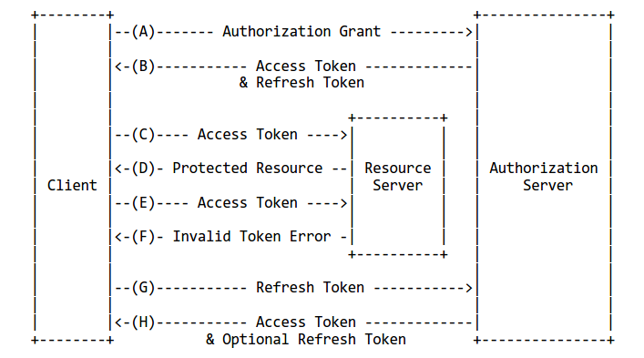

# Access Token & Refresh Token
기존 JWT 방식의 진화버전

## JWT (JSON Web Token)
두 개체에서 JSON 객체를 사용하여 정보를 안전성있게 전달하는 토큰<br>
C, Java, Python 등 대부분의 프로그래밍 언어에서 사용할 수 있음<br>
일반 토큰방식과 달리 DB 조회가 없는 것이 큰 장점

### JWT 사용 시나리오
1. 클라이언트가 웹 서버에 로그인 시도
2. 서버는 클라이언트의 정보에 해당하는 토큰 발급 후 전달
3. 클라이언트가 서버에 요청을 보낼 때 헤더에 JWT도 함께 보냄
4. 서버는 받은 토큰이 유효한지 검증하고 클라이언트의 권한을 확인

### JWT의 구조
`header.payload.signature` 구조
- __Header(헤더)__
  ```
    {
        "typ": "JWT", // type of token
        "alg": "HS256" // hashing algorithm
    }
  ```
- __Payload__ : 토큰에 담는 정보 하나를 `claim`이라고 함
  - registered claim : 토큰에 대한 정보를 담기 위해 이름이 정해진 클레임, 선택적으로 사용
    name | meaning | name | meaning
    --- | --- | --- | ----
    iss | 발급자 | sub | 제목
    aud | 대상자 (audience) | exp | 만료 시간
    nbf | 토큰이 활성되기 시작하는 날짜 | iat | 토큰이 발급된 시간
    jti | JWT의 고유 식별자
  - public claim : collision-resistant naming, URI 형식
  - private claim : 보통 클라이언트-서버 간에 사용되는 이름
- __Signature__ : 헤더의 encoding value, payload의 encoding value를 합쳐 주어진 secret key로 hashing

객체가 encoding 되는 과정에서 공백 문자나 엔터는 삭제함

---
## Refresh Token
Access Token만을 이용한 인증 방식은 단점이 존재 -> 보안성을 높이고자 유효기간을 짧게 한다면 로그인을 자주 해야 하므로 불편하고, 유효기간을 길게 하면 토큰을 탈취될 위험이 높아지므로 보안성 취약<br>

Refresh Token을 이용하면 Access Token의 유효기간을 짧게 해도 번거롭게 로그인을 자주 하지 않아도 되므로 단점을 보완할 수 있다.<br>
단, Refresh Token의 유효기간이 만료되면 다시 로그인해야 한다. 보통 약 14일의 유효기간을 두고 있다.



### 두 토큰을 사용하는 인증방식의 절차
1. 사용자가 본인의 ID, 패스워드로 로그인
2. 서버는 사용자의 ID와 PW를 회원 데이터베이스에서 비교
3. 일치하는 데이터가 존재하는 경우 서버는 Access Token과 Refresh 토큰을 발급하고 데이터베이스에 Refresh Token을 저장
4. 사용자는 응답으로 받은 Refresh Token을 안전한 곳에 저장하고 이후 요청을 보낼 때마다 Access Token을 헤더로 전달
5. 서버는 사용자가 보낸 Access Token이 유효한지 검증하여 응답을 함
6. Access Token이 만료된 경우에는 서버가 사용자에게 권한이 없다는 시그널을 보냄
7. 사용자는 서버에게 Access Token과 Refresh Token을 보냄
8. 서버는 사용자의 Access Token을 검증하고 DB 내 Refresh Token과 비교하여 새로운 Access Token을 발급

### 단점
프로세스가 많아짐에 따라 인증방식 구현의 복잡함 증가, HTTP 요청 횟수 증가에 따른 서버의 자원 소비 증가

---
### 참고
> [VELOPERT.LOG - JWT](https://velopert.com/2389)
> [자유로운 오랑우탄](https://tansfil.tistory.com/59)
